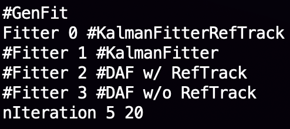

GenFit implement into the J-PARC E42 K1.8 Analyzer
====================

<div style="text-align: right;">
 2022.07.15
 </div><br>

## Environment setting

   Nothing to do. Same as K1.8-analyzer

## Features

   - GenFit package
   - GenKEK codes
   - GenKEK dsts
   - HypTPC geometry GDML

## Install

   Install the GenFit package and the GenKEK follows.

   How-to Compile:
```sh
$> cp Makefile.genfit Makefile
$> make
$> make pcms
```
   You can complie seperately 1. K1.8-Analyer(k18ana) or 2. GenKEK(genfit)

```yml
all: k18ana genfit
k18ana: lib usr dst
genfit: genkek genfit_dst
```

## Library

   lib/libK18Analyzer.a : for K1.8-analyzer compiling
   lib/ligGenKEK.a : for K1.8-analyzer & GenFit package & GenKEK compiling


## Paramters

   Add “TPCGDML io theconfR paramters
   
   And add “Fitter” & “nItertatioin the USER paramters
   
